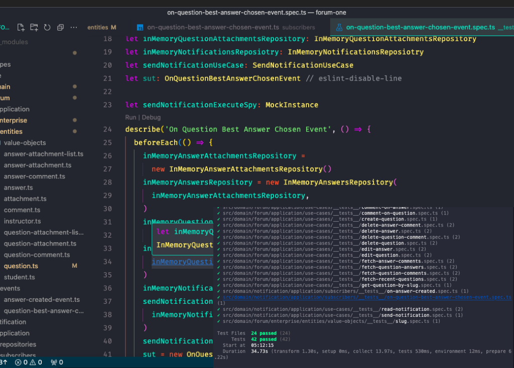

## DDD (Domain-driven Desgin)

A forum app, with questions and answers, the DDD (Domain-drive Design) method was used

## DDD

- Domain Expert
  - Conversa
- Linguagem ubíqua

- Agregados
- Value Objects
- Eventos de domínio
- Subdomínio (Bounded Contexts)
- Entidades
- Casos de usos

## Install dependencies

```bash
npm ci
```

or

```bash
pnpm install --frozen-lockfile
```

## Run app

```bash
npm run dev
```

or

```bash
pnpm dev
```

## Run tests

```bash
npm test
```

or

```bash
pnpm test
```

## Licença

Este projeto está licenciado sob a licença MIT.
